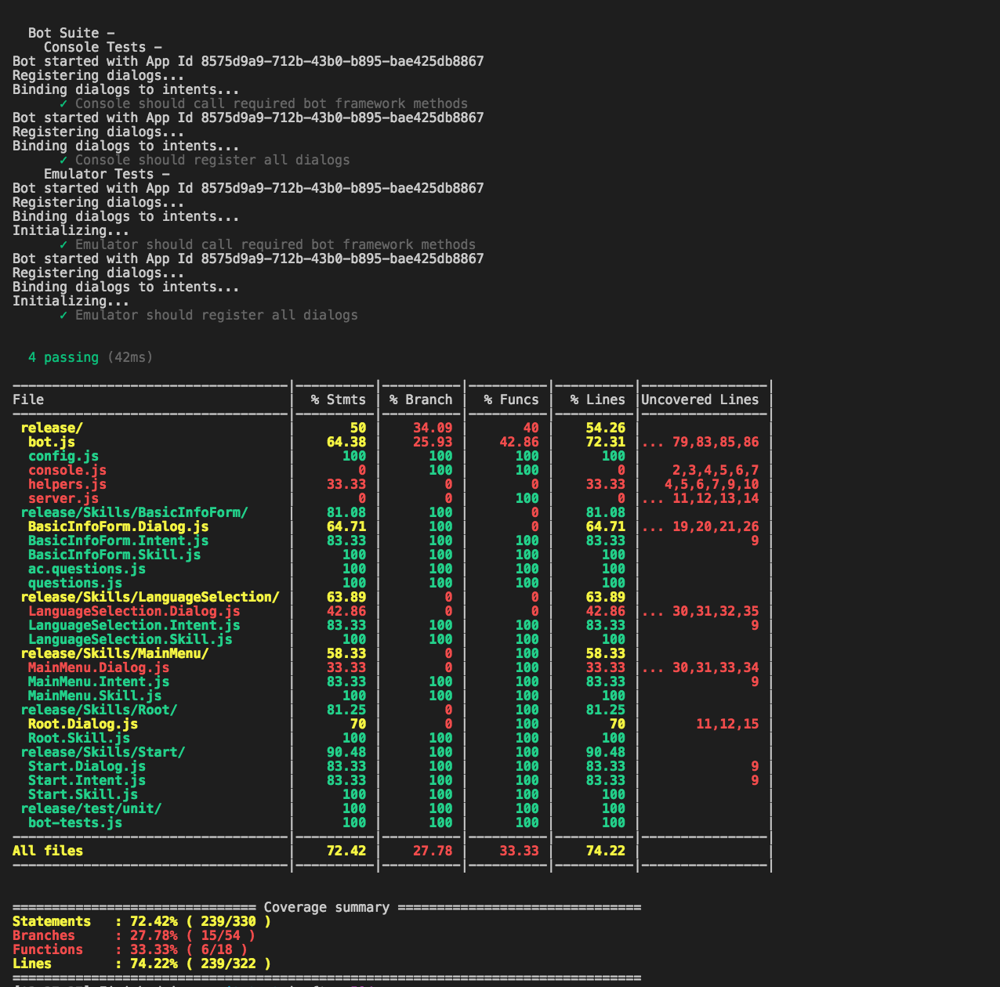

# Bot Framework Ramp-up : NODEJS


## PREQUISITIES:

* [NodeJS & Npm](https://nodejs.org/en/)
* [BotFramework-Emulator](https://github.com/Microsoft/BotFramework-Emulator) - [DOWNLOAD](https://github.com/Microsoft/BotFramework-Emulator/releases)
* [Ngrok](https://ngrok.com/)
* [VSCode](https://code.visualstudio.com/)
* [LUIS](http://luis.ai/)

## BASICS

### 1. [DOCS](https://docs.microsoft.com/en-us/bot-framework/)
### 2. [BUILD A BASIC BOT:](https://docs.microsoft.com/en-us/bot-framework/nodejs/bot-builder-nodejs-quickstart)

```
> npm init
> npm install --save botbuilder
> npm install --save restify
```
**app.js:**

```
var restify = require('restify');
var builder = require('botbuilder');

// Setup Restify Server
var server = restify.createServer();
server.listen(process.env.port || process.env.PORT || 3978, function () {
   console.log('%s listening to %s', server.name, server.url); 
});

// Create chat connector for communicating with the Bot Framework Service
var connector = new builder.ChatConnector({
    appId: process.env.MICROSOFT_APP_ID,
    appPassword: process.env.MICROSOFT_APP_PASSWORD
});

// Listen for messages from users 
server.post('/api/messages', connector.listen());

// Receive messages from the user and respond by echoing each message back (prefixed with 'You said:')
var bot = new builder.UniversalBot(connector, function (session) {
    session.send("You said: %s", session.message.text);
});
```

```
> node app.js
```

> Start the BotFramework-Emulator and connect your bot

> After you start your bot, connect to your bot in the emulator:

> 1. Type `http://localhost:3978/api/messages` into the address bar. (This is the default endpoint that your bot listens to when hosted locally.)

> 2. Click Connect. You won't need to specify Microsoft App ID and Microsoft App Password. You can leave these fields blank for now. You'll get this information later when you register your bot.


### 3. [KEY CONCEPTS:](https://docs.microsoft.com/en-us/bot-framework/nodejs/bot-builder-nodejs-concepts)

#### Connector:
> Bot Framework Connector is a service that connects your bot to multiple channels, which are clients like Skype, Facebook, Slack, and SMS.

> Connector facilitates communication between bot and user by relaying messages from bot to channel and from channel to bot. 

> Your bot's logic is hosted as a web service that receives messages from users through the Connector service, and your bot's replies are sent to the Connector using HTTPS POST.

#### Messages:
> Messages can consist of text to be displayed, text to be spoken, attachments, rich cards, and suggested actions. 

> You use the session.send method to send messages in response to a message from the user.
> 
> 

#### Saving State:

> Bot Framework provides a storage system that stores bot data, so that the bot web service can be scaled.

> Use the following properties of your bot's session object to save data relative to a user or conversation:

> **userData**: stores information globally for the user across all conversations.

> **conversationData** stores information globally for a single conversation. This data is visible to everyone within the conversation so exercise with care when storing data to this property. It’s enabled by default and you can disable it using the bot's persistConversationData setting.

> **privateConversationData** stores information globally for a single conversation but it is private data specific to the current user. This data spans all dialogs so it’s useful for storing temporary state that you want cleaned up when the conversation ends.

> **dialogData** persists information for a single dialog instance. This is essential for storing temporary information in between the steps of a waterfall in a dialog.


### 4. [DIALOGS](https://docs.microsoft.com/en-us/bot-framework/bot-design-conversation-flow)

> **Dialog stack:**

> When one dialog invokes another, the Bot Builder adds the new dialog to the top of the dialog stack. The dialog that is on top of the stack is in control of the conversation. Every new message sent by the user will be subject to processing by that dialog until it either closes or redirects to another dialog. When a dialog closes, it's removed from the stack, and the previous dialog in the stack assumes control of the conversation.


### 5. [CONVERSATION FLOW](https://docs.microsoft.com/en-us/bot-framework/nodejs/bot-builder-nodejs-dialog-manage-conversation-flow)

> The Bot Builder SDK for Node.js includes built-in features such as [`prompts`](https://docs.microsoft.com/en-us/bot-framework/nodejs/bot-builder-nodejs-dialog-prompt) and [`waterfalls`](https://docs.microsoft.com/en-us/bot-framework/nodejs/bot-builder-nodejs-dialog-waterfall) to help you manage conversation flow.


**Waterfall:**

```
var bot = new builder.UniversalBot(connector, [
	function (session) {
        session.send("Welcome to the dinner reservation.");
        builder.Prompts.time(session, "Please provide a reservation date and time (e.g.: June 6th at 5pm)");
    },
    function (session, results) {
        session.dialogData.reservationDate = builder.EntityRecognizer.resolveTime([results.response]);
        builder.Prompts.number(session, "How many people are in your party?");
    },
    ..waterfall steps..]); 
```

**Prompts:**

```
// Dialog to ask for a date and time
bot.dialog('askForDateTime', [
    function (session) {
        builder.Prompts.time(session, "Please provide a reservation date and time (e.g.: June 6th at 5pm)");
    },
    function (session, results) {
        session.endDialogWithResult(results);
    }
]);
```

## REGRISTRATION

### Create your bot here:

### [dev.botframework.com](https://dev.botframework.com/)


## TEMPLATE

### Turbo-charge your NODE SDK bot development with this: 
### [botbuilder-template](https://github.com/user1m/botbuilder-template)

#### Includes scripts for:
* Automated building, 
* Packaging of our release code, 
* Testing (using mochajs, chaijs, and sinonjs),
* Visual code coverage charts
* ... and much more


## CI-CD

### Improve code quality and catch issues early by setting up a Build and Release Pipelines on:

### [VSTS](https://www.visualstudio.com/team-services/)

#### Includes:
* Continuous Integration
* Release Management
* Error Reporting
* ... and much more

### Build


### Release


## Testing - using `botbuilder-template`

```
> npm test
```




## Hands-on Lab

#### "botbuilder-template" Lab steps:

If using LUIS: Train & Deploy your [LUIS app](http://luis.ai/)

0. Create bot on [dev.botframework](https://dev.botframework.com/)

1. Clone [botbuilder-template](https://github.com/user1m/botbuilder-template)

2. Copy `Start ` to `<NewSkill>`

3. Rename occurrences of the name `"Start"` to `<NewSkill>` in copied folder

4. Remove `Login, Start ` skill imports from `bot.ts`

5. Register `<NewSkill>` dialogs in `bot.ts`

6. Change occurrences of `Start` with `<NewSkill>` in `bot.ts`

7. Add your custom dialogs to `<NewSkill>.Dialogs.ts`

	> **NOTE:**
	
	> When you find yourself adding hard-coded bot response strings - move them to `NewSkill.Messages.ts`

	> Cards & Attachments should be put in to `NewSkill.Messages.ts`

	> Remember to break dialogs up to mini-modules - allows you to easily replace and swap out dialogs
	
	> Api calls should live in a service

	> When you want to add a BF component but don't know how... do a quick google search (i.e "Bot Framework Cards") - there are tons of sample code online

13. Configure `Root/Root.Dialog.ts` to lead into your starting dialog

12. Remove `Login, Start` from `Root/Root.Dialog.ts`

18. Delete `Login & Start` Skills folders

14. `npm run clean`
 
15. `npm run build`

16. `npm run watch` - runs a typescript watcher to compile your code in the background
 
17. `npm run server` - runs the non-webpacked emulator code so that you can edit your `.ts` files and see changes realtime

16. `npm run test` - test your bot code

19. [Setup your ci-cd pipeline](https://www.visualstudio.com/team-services/)


## Deploy

### Locally -
#### [Ngrok:](https://ngrok.com/)

```
> ngrok http 3978
```

* Copy your ngrok `https` endpoint


* Add url to `dev.botframework.com` settings


* Run the bot locally 

```
> npm start

bot should be running on localhost:3978
```

### Cloud -
#### Azure:

1). Via Git Repo

* Create an [Azure Web App](https://portal.azure.com/)
* Connect your Web App to the Git Repo via `Deployment Options`

2). Via CI-CD

* Create an [Azure Web App](https://portal.azure.com/)
* Create your CI-CD pipeline
* Deploy via Release Pipeline (`Continuous Delivery`)

## Bonus

### 1. [QNAMaker.ai](http://qnamaker.ai/) - [Instructions](https://www.npmjs.com/package/botbuilder-cognitiveservices) - Build, train and publish a simple question and answer bot based on FAQ URLs
### 2. [Bot-HandOff](https://github.com/palindromed/Bot-HandOff) - [Setup Instructions](https://www.npmjs.com/package/botbuilder-handoff) - ability to "hand off" a customer from a bot to a human agent
### 3. [Cortana-Speak](https://docs.microsoft.com/en-us/bot-framework/nodejs/bot-builder-nodejs-cortana-skill) - Build a speech-enabled bot with Cortana skills
### 4. [Offline Directline](https://github.com/ryanvolum/offline_dl) - emulate the bot framework connector locally

## DEMOBOT

#### Includes:

* LUIS Integration
* Cortana Speech
* BotHandoff Integration
* CogServices - Translator
* QNA Service
* CI-CD Pipeline
* Unit tests


## Author
* [Claudius Mbemba](https://github.com/user1m/)


